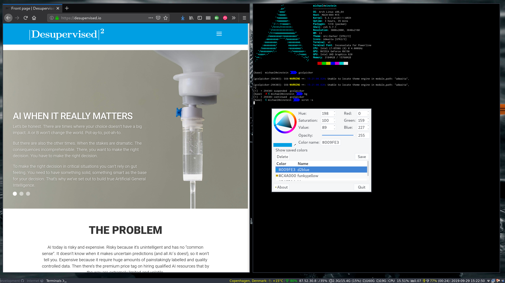

# gcolpicker
Implementation of a GTK color picker (forked from Gcolor2). It's basically a GTK2 color selector which provides a quick and easy way to find colors for whatever task is at hand. Colors can be saved and deleted as well.

[](https://travis-ci.org/DoktorMike/gcolpicker)



## Installing

Should be as simple as

```bash
git clone git@github.com:DoktorMike/gcolpicker.git
./configure
make
sudo make install
```

If you run into problems you can hardball it by running

```bash
libtoolize --copy --force
./autogen.sh
make
sudo make install
```

## Fork history
Original code v0.4 (2005-07-12) from: https://sourceforge.net/projects/gcolor2/files/gcolor2/

## Disclaimer
This project is meant to be useful for me. No further ambitions are implied.
